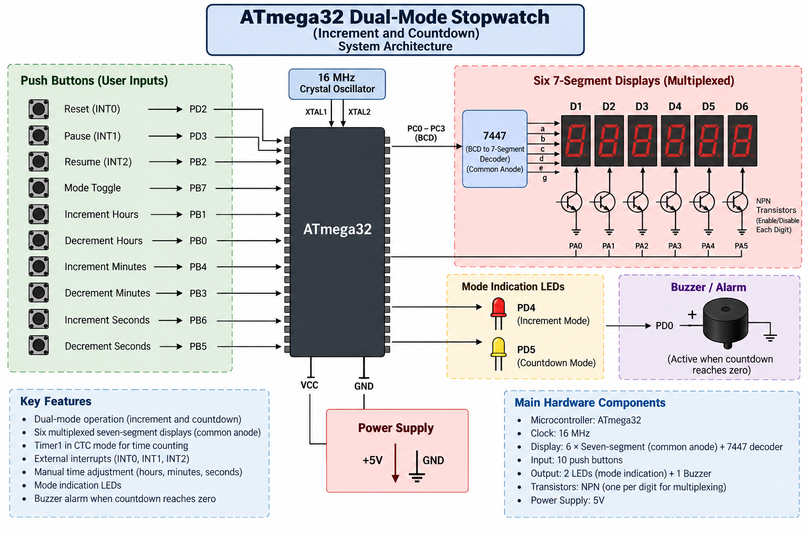

# ATmega32 Dual-Mode Stopwatch

A digital stopwatch implemented using the **ATmega32 AVR microcontroller**, supporting both **increment (count-up)** and **countdown** operating modes.

The system uses **Timer1 in CTC mode** for time counting, external interrupts for control functions, and six multiplexed common-anode seven-segment displays for displaying hours, minutes, and seconds.

## Overview

The stopwatch operates in two modes:

- **Increment Mode:** Counts upward continuously from zero.
- **Countdown Mode:** Counts downward from a user-defined starting time.

The user can pause, resume, reset, switch modes, and manually adjust the countdown hours, minutes, and seconds.

## Features

- Increment / count-up stopwatch mode
- Countdown timer mode
- Reset functionality
- Pause functionality
- Resume functionality
- Mode switching
- Manual hour adjustment
- Manual minute adjustment
- Manual second adjustment
- Six multiplexed seven-segment displays
- Common-anode 7447 BCD-to-seven-segment decoder
- Timer1 configured in CTC mode
- External interrupts using INT0, INT1, and INT2
- LED indicators for operating mode
- Buzzer alarm when countdown reaches zero
- 16 MHz system clock

## System Architecture

The system is built around the **ATmega32** and consists of:

### Input Interface

Ten push buttons provide user control:

| Function | Pin |
|---|---|
| Reset | PD2 / INT0 |
| Pause | PD3 / INT1 |
| Resume | PB2 / INT2 |
| Mode Toggle | PB7 |
| Increment Hours | PB1 |
| Decrement Hours | PB0 |
| Increment Minutes | PB4 |
| Decrement Minutes | PB3 |
| Increment Seconds | PB6 |
| Decrement Seconds | PB5 |

### Time Management

**Timer1** is configured in **CTC (Clear Timer on Compare Match) mode** and is used to generate the timing required for stopwatch operation.

The stopwatch maintains:

- Hours
- Minutes
- Seconds

The system supports both incrementing and decrementing these values depending on the selected mode.

### Display

The current time is displayed using **six multiplexed common-anode seven-segment displays**.

A single **7447 BCD-to-seven-segment decoder** is shared between the displays.

The six display enable signals are controlled through:

- PA0
- PA1
- PA2
- PA3
- PA4
- PA5

NPN transistors are used to enable and disable individual seven-segment displays during multiplexing.

Because the displays are switched rapidly, persistence of vision makes them appear continuously illuminated.

### External Interrupts

The project uses three external interrupts:

- **INT0:** Reset — falling edge
- **INT1:** Pause — rising edge
- **INT2:** Resume — falling edge

These interrupts provide immediate response to the corresponding control buttons.

### Mode Indicators

Two LEDs indicate the current operating mode:

| LED | Pin | Mode |
|---|---|---|
| Red | PD4 | Increment |
| Yellow | PD5 | Countdown |

### Countdown Alarm

A buzzer is connected to **PD0**.

When countdown mode reaches zero, the buzzer is activated to notify the user that the countdown has finished.

## Operating Modes

### Increment Mode

Increment mode is the default operating mode.

After power-up:

1. The stopwatch starts from zero.
2. Timer1 provides the time base.
3. The displayed time continuously counts upward.
4. The red LED on PD4 indicates increment mode.

### Countdown Mode

To use countdown mode:

1. Pause the stopwatch.
2. Toggle the mode using the button connected to PB7.
3. Adjust the desired hours, minutes, and seconds.
4. Press Resume through INT2.
5. The stopwatch begins counting down.
6. When the time reaches zero, the buzzer is activated.

The yellow LED on PD5 indicates countdown mode.

## Interrupt Configuration

| Interrupt | Pin | Trigger | Function |
|---|---|---|---|
| INT0 | PD2 | Falling Edge | Reset |
| INT1 | PD3 | Rising Edge | Pause |
| INT2 | PB2 | Falling Edge | Resume |

## Hardware Components

- ATmega32 Microcontroller
- 16 MHz clock
- Six common-anode seven-segment displays
- 7447 BCD-to-seven-segment decoder
- NPN BJT transistors for display multiplexing
- 10 push buttons
- Red LED
- Yellow LED
- Buzzer
- Resistors
- 5V power supply

## Hardware Connections

### Seven-Segment Display

The 7447 decoder receives BCD data from the ATmega32 through the first four pins of PORTC.

The six display enable lines use:

`PA0 – PA5`

Each seven-segment display is individually enabled through an NPN transistor.

### Control Inputs

The reset, pause, and resume buttons are connected to the ATmega32 external interrupt pins, while the remaining buttons are used for mode selection and time adjustment.

## Program Flow

The general operation can be represented as:

    System Start
         |
         v
    Increment Mode
         |
         v
    Timer1 CTC
         |
         v
    Update Time
         |
         v
    Multiplex Display
         |
         +----------------------+
         |                      |
         v                      v
      Pause                  Mode Toggle
         |                      |
         v                      v
      Hold Time            Countdown Mode
                                |
                                v
                         Adjust Start Time
                                |
                                v
                              Resume
                                |
                                v
                         Countdown Running
                                |
                                v
                            Time = 0?
                           /         \
                         No           Yes
                         |             |
                         |             v
                         +--------> Buzzer

## Project Structure

    ATmega32-Dual-Mode-Stopwatch/
    ├── README.md
    ├── ATmega32-Dual-Mode-Stopwatch-Architecture.png
    └── Source/
        └── Project source files

## Concepts Demonstrated

- Embedded C programming
- ATmega32 microcontroller programming
- Timer configuration
- Timer1 CTC mode
- External interrupts
- Interrupt edge configuration
- Seven-segment display control
- Display multiplexing
- BCD-to-seven-segment decoding
- Push-button interfacing
- LED control
- Buzzer control
- Real-time event handling
- Modular embedded software design

## Project Specification

This project was developed as part of the **Standard Embedded Diploma – Mini Project 2** and follows the provided project requirements for an ATmega32 dual-mode stopwatch. The specification defines the increment and countdown modes, Timer1 CTC configuration, multiplexed seven-segment display, external interrupt behavior, manual time adjustment, mode indicators, and countdown alarm.

## Author

**Adham Muhammed**

Embedded SW Engineer
